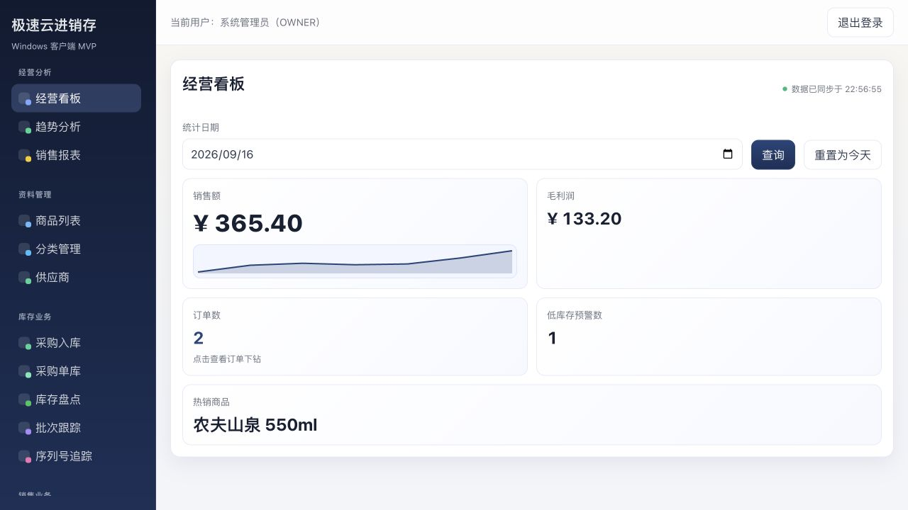
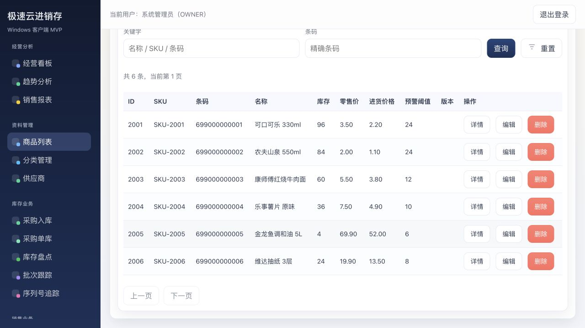
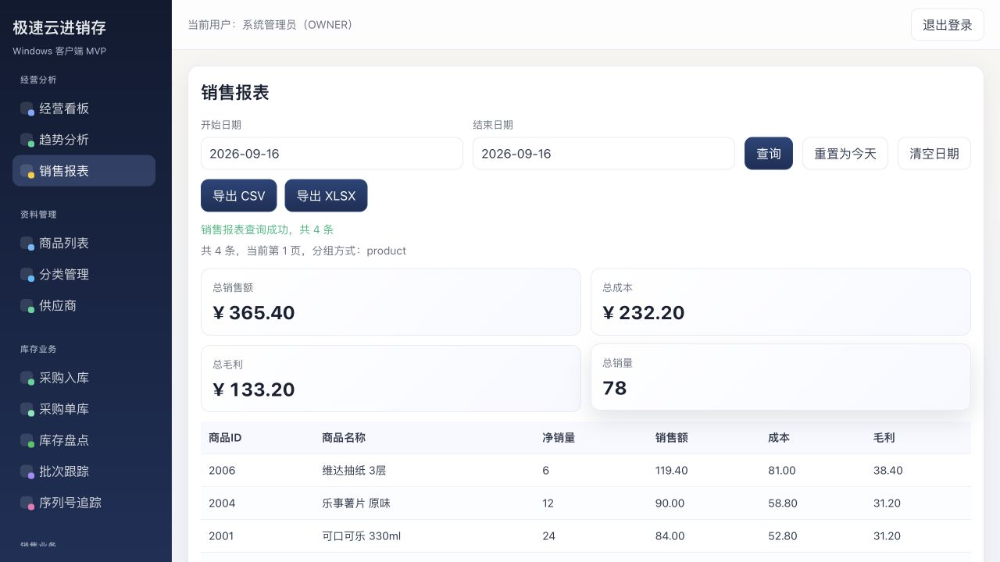

# Hyper JXC (极速云进销存)

[](https://github.com/Drac0nids/jxc/actions/workflows/ci.yml)
[](LICENSE)

[中文文档](README.md) | English

**One Rust business core, three delivery forms.** The same domain logic and API contract back a
multi-tenant SaaS deployment, a Windows standalone desktop app, and an Android standalone app.
Both standalone forms are **install-and-run**: no server, no separate database, fully offline.

- **Server (Rust + Axum)**: tenant isolation, inventory consistency, document state machines, audit trail; PostgreSQL and SQLite backends.
- **Windows client (Tauri 2 + Vue 3)**: day-to-day operations - products, purchase and sales documents, stocktaking, reports, audit, printing.
- **Android client (Flutter)**: mobile work - camera barcode scanning and handheld scanner input for inbound, outbound and stocktaking flows.

## Download (standalone builds)

| Platform | Artifact | Requirements |
| --- | --- | --- |
| **Android** | [jxc-android-standalone.apk](https://github.com/Drac0nids/jxc/releases/latest/download/jxc-android-standalone.apk) (~70 MB) | Android 7.0+ (minSdk 24); arm64-v8a / armeabi-v7a |
| **Windows installer** | [jxc-windows-x64-setup.exe](https://github.com/Drac0nids/jxc/releases/latest/download/jxc-windows-x64-setup.exe) | Windows 10/11 x64 + WebView2 runtime |
| **Windows portable** | [jxc-windows-x64-portable.zip](https://github.com/Drac0nids/jxc/releases/latest/download/jxc-windows-x64-portable.zip) | Same as above, unzip and run |

Every artifact ships with a matching `.sha256` file. Older builds are under
[Releases](https://github.com/Drac0nids/jxc/releases).

> On first launch the standalone build creates a local tenant (code `local`) and an admin account
> `admin` / `admin123`. **Change the default password before real use.**

### Windows client

<p align="center">
  
</p>

<p align="center">
  
  
</p>

### Android standalone

<p align="center">
  
  
  
</p>

## Why it is interesting

**The Axum server is compiled into a `cdylib` and started inside the Android app process over FFI.**

Android 10+ forbids executing binaries from the app data directory, so the usual "server as a
sidecar process" approach does not work on a phone. Here the server is built into
`libjxc_server.so`, packaged inside the APK, and started from Dart via `dart:ffi`, bound to
`127.0.0.1` on an OS-assigned port. That is how the same Rust business code actually fits into a
single handset. On Windows the same server runs as a Tauri sidecar child process instead.

## Delivery forms

| Form | Intended for | Composition | Storage |
| --- | --- | --- | --- |
| **Android standalone** | A shop that only has a phone | Single APK; server compiled to `libjxc_server.so` and started in-process | Local SQLite file (app-private directory) |
| **Windows standalone** | Single-store, single-machine shops without ops capacity | One desktop app; server embedded as a Tauri sidecar | Local SQLite file |
| **SaaS (multi-tenant)** | Growing merchants with several stores and roles | Server and clients deployed separately | PostgreSQL + Redis |

## Feature highlights

- **Inventory**: single and batch inbound/outbound, stock ledger with snapshots, low-stock alerts, moving weighted average cost.
- **Stocktaking**: `DRAFT -> COUNTING -> CONFIRMED` state machine with book-stock drift detection.
- **Purchase and sales orders**: `DRAFT -> CONFIRMED -> VOIDED` and `DRAFT -> CONFIRMED -> RETURNED_PARTIAL / RETURNED_FULL`, with reversal entries instead of physical deletes.
- **Products**: soft delete, tenant-unique barcode, scan-to-lookup with local cache, categories, batches, suppliers, serial numbers.
- **Reports**: dashboard, trends, per-product sales report, CSV / XLSX export with styled headers, frozen panes and summary rows.
- **Multi-tenant**: `tenant_id` isolation end to end, JWT access/refresh tokens, RBAC (OWNER / ADMIN / PURCHASER / SALES).

## Tech stack

| Layer | Choice |
| --- | --- |
| Server | Rust (edition 2024), Axum 0.7, sqlx 0.8, PostgreSQL, Redis, JWT, `rust_decimal` |
| Storage | PostgreSQL for SaaS, SQLite for standalone; 17 migrations each, applied on startup |
| Windows client | Tauri 2, Vue 3, TypeScript, Pinia, axios, Vite |
| Android client | Flutter, dio, mobile_scanner, fl_chart, shared_preferences, `dart:ffi` |
| Packaging | Tauri sidecar (Windows), `cargo-ndk` + `cdylib` + JNI-free FFI (Android) |

## Quick start

Server:

```bash
cd server
cp .env.example .env        # adjust DATABASE_URL / JWT_SECRET / REDIS_URL
cargo run                   # migrations are applied on startup
```

Run the server in standalone (SQLite) mode:

```bash
cd server
STORAGE_BACKEND=sqlite SQLITE_PATH=jxc.db cargo run
```

Android client:

```bash
cd app
flutter pub get
flutter run --dart-define=API_BASE_URL=http://127.0.0.1:8080/api/v1
```

Build the Android standalone APK (embeds the server as a `.so`):

```bash
rustup target add aarch64-linux-android armv7-linux-androideabi
cargo install cargo-ndk
./scripts/build-android-local.sh
```

Windows client:

```bash
cd client
npm install
npm run tauri:dev
```

## Testing

```bash
cd server && cargo test      # 123 tests: 118 passed / 5 ignored (see Known gaps)
cd app && flutter analyze --no-fatal-infos && flutter test
cd client && npm run typecheck && npm run build
```

12 PostgreSQL repository regression tests skip by default; set `TEST_DATABASE_URL` (or
`DATABASE_URL`) to run them. CI starts a `postgres:16` service container and runs all of them
against schema generated by the real `migrations/`.

## Known gaps

These are explicitly **not implemented yet**, listed here rather than left implied:

- **Optimistic locking (`expected_version` to `4091`) is not implemented.** The API contract,
  routes and request bodies accept and forward `expected_version`, but neither the PostgreSQL nor
  the SQLite repository consumes it, so sending the field currently has no effect and reports no
  conflict. The 5 related regression tests are marked `#[ignore]` with that reason.
- **ID allocation uses `MAX(id) + 1`.** It is serialized with `pg_advisory_xact_lock` to avoid
  primary-key collisions; migrating to PostgreSQL `SEQUENCE` is still pending.
- **APK size is about 70 MB** (two ABIs plus the barcode native library); LTO and per-form
  dependency trimming are not done.
- **Android offline queue and refresh-token auto-renewal** are not implemented.
- **Release artifacts are signed with the debug key**; a release keystore is required before
  public distribution.

## Contributing

Issues and pull requests are welcome. See [CONTRIBUTING.md](CONTRIBUTING.md) for the workflow and
local verification requirements. For security issues, follow [SECURITY.md](SECURITY.md) instead of
opening a public issue.

## License

Licensed under the [Apache License 2.0](LICENSE).
