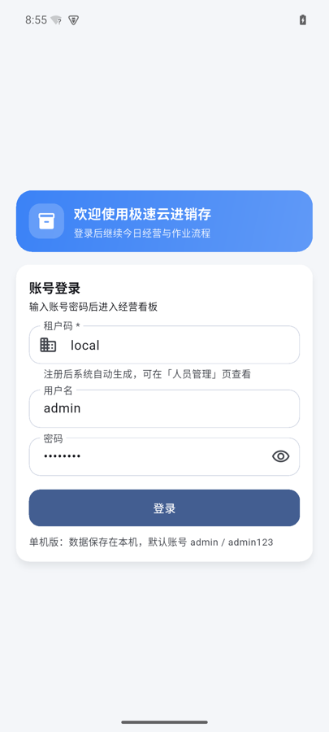
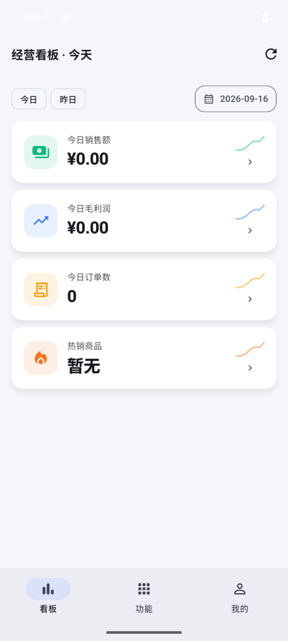
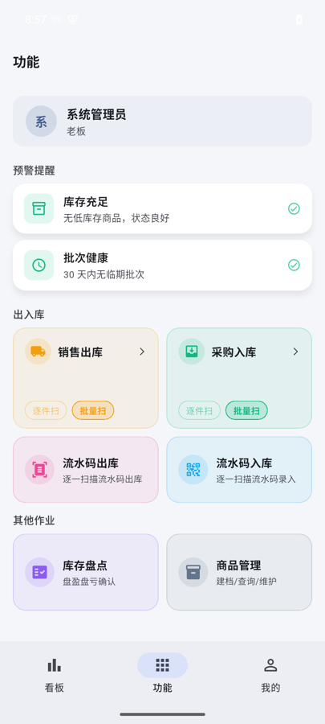

# 极速云进销存（Hyper JXC）

[](https://github.com/Drac0nids/jxc/actions/workflows/ci.yml)
[](LICENSE)

**一套 Rust 业务内核，三种交付形态。** 同一套领域逻辑与 API 契约同时支撑多租户 SaaS、Windows 单机版
和 Android 单机版；两个单机形态**安装即用** —— 不需要服务器、不需要单独安装数据库、完全离线运行。

- **服务端（Rust + Axum）**：多租户隔离、库存一致性、单据状态机与审计追踪，PostgreSQL / SQLite 双仓储。
- **Windows 端（Tauri 2 + Vue 3）**：侧重经营与管理，覆盖建档、开单、盘点、报表、审计与打印场景。
- **Android 端（Flutter）**：侧重移动作业，覆盖摄像头扫码与扫码枪连续录入的入库、出库、盘点链路。

## 下载（单机版，装完就能用）

| 平台 | 产物 | 运行要求 |
| --- | --- | --- |
| **Android** | [jxc-android-standalone.apk](https://github.com/Drac0nids/jxc/releases/latest/download/jxc-android-standalone.apk)（约 70 MB） | Android 7.0+（minSdk 24）；arm64-v8a / armeabi-v7a |
| **Windows 安装包** | [jxc-windows-x64-setup.exe](https://github.com/Drac0nids/jxc/releases/latest/download/jxc-windows-x64-setup.exe) | Windows 10/11 x64 + WebView2 运行时（较新系统已内置） |
| **Windows 便携版** | [jxc-windows-x64-portable.zip](https://github.com/Drac0nids/jxc/releases/latest/download/jxc-windows-x64-portable.zip) | 同上，解压即用 |

每个产物都随附同名 `.sha256` 校验文件；历史版本见 [Releases](https://github.com/Drac0nids/jxc/releases)。

> 单机版首次启动会自动创建本地租户（租户码 `local`）与管理员账号 `admin` / `admin123`。
> 数据保存在本地（桌面端为 SQLite 文件，Android 端为应用私有目录，卸载即清理）。
> **正式使用前请先修改默认密码。**

<p align="center">
  
  
  
</p>

## 为什么值得一看

**Android 上把 Axum 服务端编译成 `cdylib`，在 App 进程内用 FFI 拉起。**

Android 10+ 禁止从应用数据目录执行二进制，所以「服务端当 sidecar 子进程」这条路在手机上走不通。
本项目把服务端编成 `libjxc_server.so` 打进 APK，由 Dart 通过 `dart:ffi` 在 App 进程内启动，
只监听 `127.0.0.1`、端口由系统分配 —— 于是同一套 Rust 业务代码真的能落进一部手机里。
Windows 端不受此限制，服务端以 Tauri sidecar 子进程方式内嵌。

## 交付形态

同一套业务代码与领域逻辑支撑三种交付形态，差异只在存储实现与进程编排：

| 形态 | 适用对象 | 组成 | 数据存储 |
| --- | --- | --- | --- |
| **Android 单机版** | 只有一台手机的最小商户 | 单个 APK：服务端编译为 `libjxc_server.so`，在 App 进程内启动 | 本地 SQLite 数据文件（应用私有目录） |
| **Windows 单机版** | 单店、单机、无运维能力的个体商户 | 单个桌面应用：内嵌服务端（Tauri sidecar）+ 打包后的前端 | 本地 SQLite 数据文件 |
| **SaaS 版（多租户）** | 多门店、多角色的成长型商户 | 服务端与客户端分离部署 | PostgreSQL + Redis |

两个单机形态都是安装即用、可完全离线运行；SaaS 形态在需要多门店协同与集中数据时启用。
Android 端也可通过 `--dart-define=API_BASE_URL` 指向远端服务端，作为 SaaS 的移动端使用。

## 项目定位

中小商贸企业的库存管理普遍存在三类问题：库存数据分散、更新滞后；扫码/开单/盘点依赖人工，差错率高；
多门店多角色协同缺少统一数据源。

本项目设计上强调三点：

- **准确**：库存与成本变更走数据库事务，出入库对商品行加锁（`SELECT ... FOR UPDATE`），成本使用移动加权平均，全部变更留不可变流水。
- **可追溯**：库存流水与审计日志记录变动数量、库存快照、成本快照、操作人与 `request_id`。
- **可重放**：写接口幂等（`X-Idempotency-Key`），重放返回首次结果，重试安全。

## 已实现能力

### 服务端

| 领域 | 能力 |
| --- | --- |
| 认证与租户 | 注册 / 登录 / 刷新 / 登出，JWT（Access + Refresh），`tenant_id` 全链路隔离，RBAC 角色（OWNER / ADMIN / PURCHASER / SALES） |
| 用户管理 | 用户列表、创建用户、修改角色、删除用户 |
| 商品中心 | 商品 CRUD（软删除）、条码租户内唯一、扫码查品（本地缓存 + 可选第三方回源）、分类、批次、供应商 |
| 序列号 | SN 逐码入库 / 出库、序列号查询与历史追溯 |
| 库存作业 | 单条与批量入库、出库、库存流水查询、低库存预警 |
| 库存盘点 | 盘点单状态机 `DRAFT → COUNTING → CONFIRMED`，盘点基准库存漂移检测，差异写入 `ADJ_CHECK` 流水 |
| 采购单 | 状态机 `DRAFT → CONFIRMED → VOIDED`，确认写 `IN_PURCHASE` 流水并更新加权成本，作废写反向流水 |
| 销售单 | 状态机 `DRAFT → CONFIRMED → RETURNED_PARTIAL / RETURNED_FULL`，支持部分与全部退货（`RETURN_SALE`） |
| 报表 | 经营看板、经营趋势、销售报表（按商品聚合）、CSV / XLSX 导出（含表头样式、冻结、筛选、SUMMARY 汇总行） |
| 审计 | 审计日志查询，关键动作记录 `before_data` / `after_data` / `request_id` |
| 运维 | `openapi.yaml` 接口契约、systemd 部署脚本、备份脚本、健康检查脚本 |

### Windows 客户端

登录、经营看板（订单下钻）、商品管理（增删改查）、采购入库、销售出库、采购单 / 销售单 / 盘点单状态流、
低库存预警、库存流水、审计日志、销售报表与导出。

### Android 端

注册 / 登录 / 登出与会话持久化；经营看板与订单下钻、销售趋势、利润趋势、热销榜；商品管理
（商品档案、分类管理、批次与效期批次、低库存预警）；摄像头 / 扫码枪 / 手工输入三种方式兼容的入库与出库扫码
（含确认后自动续扫）；采购单、库存盘点与盘点流水、入库记录查询。

## 技术栈

| 层 | 选型 |
| --- | --- |
| 服务端 | Rust（edition 2024）+ Axum 0.7 + sqlx 0.8 + PostgreSQL + Redis + JWT + `rust_decimal` |
| 数据 | PostgreSQL（SaaS 主链路）或 SQLite（单机版），各 17 个迁移脚本、启动时自动应用；Redis 用于幂等与缓存，未配置时退回内存态 |
| Windows 端 | Tauri 2 + Vue 3 + TypeScript + Pinia + axios + Vite |
| Android 端 | Flutter + dio + mobile_scanner + fl_chart + shared_preferences + `dart:ffi`（加载内嵌服务端） |
| 单机打包 | Tauri sidecar（Windows）/ `cargo-ndk` + `cdylib` + JNI-free FFI（Android） |

## 仓库结构

```text
jxc/
├─ server/                 # Rust + Axum 服务端
│  ├─ src/routes/          # auth / products / inventory / purchase_orders / sales_orders
│  │                       # stock_checks / serials / batches / categories / suppliers
│  │                       # reports / audit / users
│  ├─ src/repository.rs           # PostgreSQL 仓储实现
│  ├─ src/repository_sqlite.rs    # SQLite 仓储实现（单机版）
│  ├─ migrations/          # 17 个 PostgreSQL 迁移脚本
│  ├─ migrations/sqlite/   # 17 个等价的 SQLite 迁移脚本
│  ├─ openapi.yaml         # OpenAPI 3.0 接口契约
│  ├─ scripts/             # 部署、备份、健康检查、冒烟脚本
│  └─ deploy/              # systemd 服务单元
├─ client/                 # Windows 客户端（Tauri + Vue 3）
│  ├─ src/pages/           # 看板、商品、入库、出库、单据、盘点、报表、审计
│  └─ src-tauri/           # Tauri Rust 壳工程（单机版以 sidecar 内嵌服务端）
├─ app/                    # Android 端（Flutter）
│  └─ lib/src/features/    # auth / dashboard / inventory / products …
│  └─ android/app/src/main/jniLibs/  # 各 ABI 的 libjxc_server.so（构建产物，不入库）
├─ scripts/                # build-local.sh（Windows 单机版）/ build-android-local.sh（Android 单机版）
├─ docs/                   # 项目上下文、技术上下文、系统模式、进度记录、界面截图
├─ 产品需求文档.md          # PRD 基线
├─ 架构设计文档.md          # 架构设计基线
└─ API接口定义文档.md       # 接口契约基线
```

## 快速开始

### 服务端

```bash
cd server
cp .env.example .env        # 按需修改 DATABASE_URL / JWT_SECRET / REDIS_URL
cargo run                   # 启动时自动应用 migrations/
```

默认监听 `http://0.0.0.0:8080`，数据库迁移随启动自动执行。默认测试账号：`admin` / `admin123`。

```bash
curl -s http://127.0.0.1:8080/health
```

完整接口清单与调用示例（含幂等、冲突码、导出、审计查询）见 [`server/README.md`](server/README.md)；接口契约见 [`server/openapi.yaml`](server/openapi.yaml)。

### Android 端

```bash
cd app
flutter pub get
flutter run --dart-define=API_BASE_URL=http://127.0.0.1:8080/api/v1
```

### Windows 客户端

```bash
cd client
npm install
npm run dev                 # 前端开发模式
npm run tauri:dev           # Tauri 桌面开发
```

### Windows 单机版

把服务端编译为 Tauri sidecar，与前端一起打成单个桌面应用：

```bash
./scripts/build-local.sh                                # 本机原生构建
TARGET=x86_64-pc-windows-gnu ./scripts/build-local.sh   # 交叉编译 Windows 版
```

产物位于 `client/src-tauri/target/<target>/release/bundle/`。

也可以让服务端单独以单机模式跑起来（调试用）：

```bash
cd server
STORAGE_BACKEND=sqlite SQLITE_PATH=jxc.db cargo run
```

首次启动会自动创建单机租户（租户码 `local`）与管理员账号，数据落在 `SQLITE_PATH` 指定的 SQLite 文件里。

> `client/src-tauri/binaries/` 存放 sidecar 产物，不入库，由构建脚本生成。

### Android 单机版

服务端编译为 `libjxc_server.so`（`cdylib`），随 APK 分发，由 App 通过 `dart:ffi` 在进程内启动，
只监听 `127.0.0.1`、端口由系统分配：

```bash
rustup target add aarch64-linux-android armv7-linux-androideabi
cargo install cargo-ndk

./scripts/build-android-local.sh                          # arm64 + armv7
ABIS=arm64-v8a ./scripts/build-android-local.sh           # 只编 arm64（更快）
```

产物：`app/build/app/outputs/flutter-apk/app-release.apk`（同时生成 `app/android/app/src/main/jniLibs/<abi>/libjxc_server.so`）。

## 工程约束

跨端统一约定，改动任何一端都必须保持一致：

| 约定 | 内容 |
| --- | --- |
| 响应结构 | `code / message / data / request_id` |
| 幂等 | 写接口必须带 `X-Idempotency-Key`；重放返回首次结果并附 `X-Idempotent-Replay: true` |
| 冲突码 | 业务冲突 `4090`，幂等请求体冲突 `4092`（`4091` 预留给乐观锁，见「已知缺口」） |
| 金额 | API 传输用字符串（最多 4 位小数），服务端映射 `rust_decimal`，数据库 `DECIMAL(16,4)` |
| 库存字段 | `current_stock`（当前可用库存）、`unit_cost`（本次入库进价）、`cost_price`（当前加权成本） |
| 单据可逆性 | 已确认单据禁止物理删除，只能通过作废 / 退货产生反向流水 |

## 质量与测试

```bash
cd server && cargo test      # 123 个用例：118 passed / 5 ignored（原因见「已知缺口」）
cd app && flutter analyze && flutter test
cd client && npm run typecheck && npm run build
```

服务端测试覆盖业务主链路、幂等重放与冲突、盘点口径、报表口径与权限边界。其中 12 个
Postgres 仓储回归用例默认**自动跳过**，配置 `TEST_DATABASE_URL`（或 `DATABASE_URL`）后启用；
CI 会起一个 `postgres:16` service container 把它们全部跑起来，且测试表结构直接来自
`migrations/`，与生产保持一致。

`.github/workflows/` 下共 4 条流水线：

| 工作流 | 触发 | 作用 |
| --- | --- | --- |
| `ci.yml` | push / PR | 版本号一致性、服务端测试（含 Postgres）、`flutter analyze` + `flutter test`、`vue-tsc` 类型检查与构建 |
| `android-apk.yml` | `app/**`、`server/**` 变更 / 手动 | 构建 APK 并校验内嵌服务端存在 |
| `client-windows-installer.yml` | `client/**`、`server/**` 变更 / 手动 | 构建 NSIS 安装包与便携包 |
| `release.yml` | 推送 `v*` tag | 复用上面两条构建流水线，自动创建 GitHub Release 并附加全部产物 |

## 文档基线

项目采用「文档先行」的开发约束（见 [`.clinerules`](.clinerules)）：任何业务代码改动前，先更新以下三份基线文档，再进入实现。

| 文档 | 作用 |
| --- | --- |
| [`产品需求文档.md`](产品需求文档.md) | 功能范围、优先级、验收标准与交互规则 |
| [`架构设计文档.md`](架构设计文档.md) | 分层架构、数据模型、事务与并发策略、状态机 |
| [`API接口定义文档.md`](API接口定义文档.md) | 接口清单、字段约束、错误码与幂等语义 |

`docs/` 目录下另有面向开发的上下文记录：`productContext.md`、`techContext.md`、`systemPatterns.md`、`activeContext.md`、`progress.md`。

## 项目规模

| 部分 | 代码量 |
| --- | --- |
| 服务端 Rust（含 PostgreSQL / SQLite 双仓储 + 进程内嵌 FFI 入口） | ~28,100 行 |
| Android Dart | ~28,100 行 |
| Windows 客户端 Vue / TypeScript / Tauri | ~11,000 行 |
| 数据库迁移 SQL（PostgreSQL + SQLite 两份，各 17 个） | ~890 行 |
| 需求 / 架构 / API 基线文档 | ~5,500 行 |

## 已知缺口

以下部分当前**明确未完成**，列在这里而不是留在文档里当「已实现」：

1. **乐观锁（`expected_version` → `4091`）尚未落地。** API 契约、路由与请求体已经预留并透传
   `expected_version`，但 PostgreSQL 与 SQLite 两个仓储实现都还没有消费它，因此客户端传入该字段
   目前**不会产生冲突检测**，也不会报错。相关的 5 个仓储回归用例以 `#[ignore]` 标记并注明了原因。
2. **ID 分配走 `MAX(id) + 1`。** 已用 `pg_advisory_xact_lock` 串行化，避免并发事务撞主键；
   更彻底的做法是迁移到 PostgreSQL `SEQUENCE`，尚未进行。
3. **APK 体积约 70 MB**，主要来自双 ABI 的 Flutter 运行时与条码扫描原生库，尚未做 LTO 与按形态裁剪。
4. **Android 端离线队列与 Refresh Token 自动续期**未实现。
5. **Android 发布产物仍使用 debug 签名**（`app/android/app/build.gradle.kts`），正式分发前需要配置 release keystore。

## 路线图

已完成 M1（认证、商品、采购入库、销售出库）、M2（盘点、低库存预警、看板、销售报表、审计）、
M3（PostgreSQL 持久化主链路、导出、契约与运维闭环）、Windows 单机版（SQLite + Tauri sidecar 单包分发）、
Android 单机版（服务端编译为 `cdylib`，App 进程内启动）。

后续计划：

1. 落地乐观锁：补全 `expected_version` 语义与 `4091` 冲突返回，并让 5 个 `#[ignore]` 用例转正。
2. ID 分配迁移到 PostgreSQL `SEQUENCE`，替代 `MAX(id) + 1` + advisory lock。
3. Android APK 体积优化（LTO、按交付形态裁剪 `redis` / `reqwest` 等仅 SaaS 需要的依赖），并配置 release 签名。
4. Android 端离线队列与冲突处理，以及 Refresh Token 自动续期。
5. 双份迁移脚本（PostgreSQL / SQLite）一致性校验，避免三种形态出现语义漂移。
6. 自动化压测基线（库存并发、离线重放、幂等冲突）。

## 参与贡献

欢迎提交 issue 与 PR，流程与本地验证要求见 [CONTRIBUTING.md](CONTRIBUTING.md)；
安全问题请按 [SECURITY.md](SECURITY.md) 的方式私下报告，不要开公开 issue。

## 许可

本项目基于 [Apache License 2.0](LICENSE) 开源。
